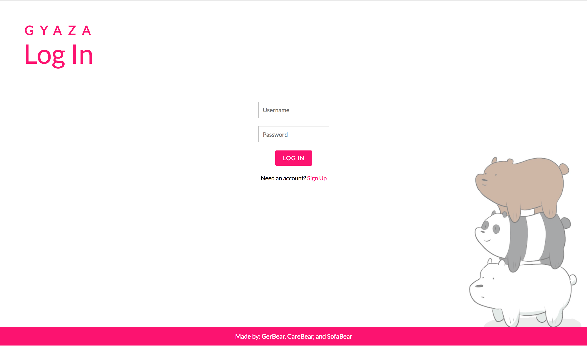
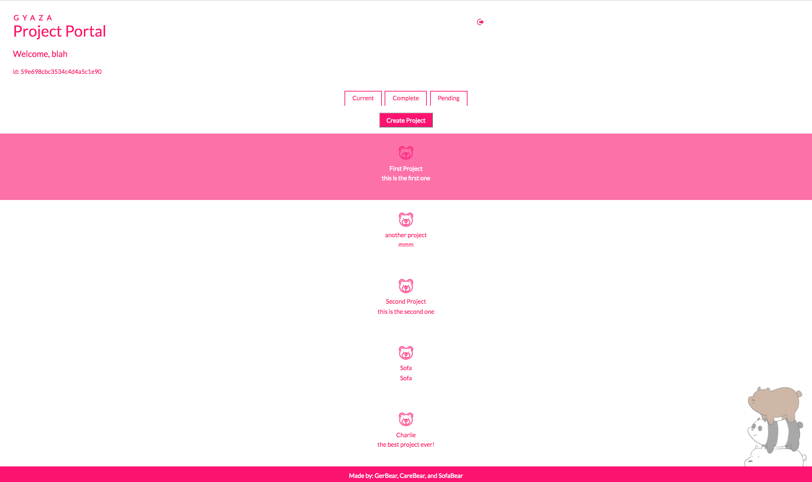
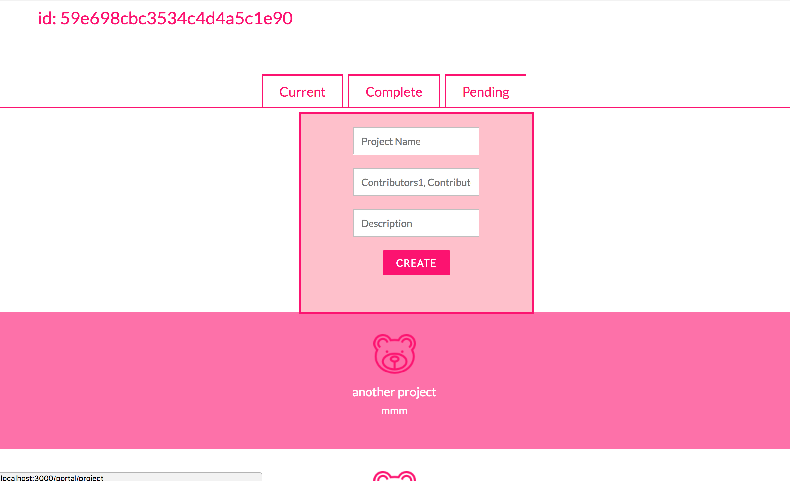
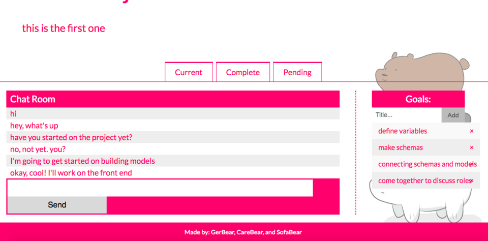

# GYAZA DOCUMENTATION
### By: GerBear, CareBear, and SofaBear

Welcome to Gyaza! Gyaza in Japanese means "to gather" and that is exactly what this application is for! Gyaza is a place for people working on projects to gather together to better communicate, set goals, and create projects. It is a project management tool that enhances team collaboration and helps creative teams to organize their work and tasks.

## Here is the URL: https://git.heroku.com/stormy-escarpment-83440.git

## KEY FEATURES

Once you log in, you can create a project with contributors who can also access the same project page. When you click on a project, it will take you to your project page where you can have a chatroom discussion with your teammates. This project page also has a Goals list where you or a team member can add and/or delete goals for your group project. 



At the top of each project portal page, you will see tabs that can take you to your current projects, completed projects, or pending projects. Your pending projects are projects that a user has invited you to that are awaiting your approval. Once you accept the invitation to a project, it will be sent to your current projects page. After your team has completed a project, you can mark it as completed and it will be moved to the completed tab for future reference if needed.





In the Goals table, you will be able to up-vote or down-vote a goal and each member of your team will be able to mark it as completed before it can be crossed off your list. That way, every member of your team will have agree and be on the same page before you can move on with your project. 



# DEPENDENCIES

```
  "dependencies": {
    "bcrypt": "^1.0.3",
    "bcrypt-nodejs": "0.0.3",
    "body-parser": "^1.18.2",
    "bson": "^1.0.4",
    "bson-ext": "^1.0.5",
    "cookie-parser": "^1.4.3",
    "dotenv": "^4.0.0",
    "ejs": "^2.5.7",
    "express": "^4.16.2",
    "express-session": "^1.15.6",
    "kerberos": "0.0.23",
    "mongodb": "^2.2.33",
    "mongodb-core": "^2.1.17",
    "mongoose": "^4.12.3",
    "morgan": "^1.9.0",
    "node-gyp": "^3.6.2",
    "passport": "^0.4.0",
    "passport-github2": "^0.1.11",
    "passport-local": "^1.0.0",
    "socket.io": "^2.0.3"
  }
```

# PUBLIC ENDPOINTS

CRUD Methods |    Route                   | RESTful Description   |         Purpose
------------ | -------------------------- | --------------------- | ------------------------
GET          | /newUser                   | User Read             | Lists all User
GET          | /newUser/:id               | User Read one         | Lists selected User
POST         | /newUser                   | User Create new       | Creates new User
PUT          | /newUser/:id               | User update           | Updates existing User
DELETE       | /newUser/:id               | User Delete           | Deletes selected User
GET          | /newProject                | project Read          | Listing all projects
GET          | /newProject/:id            | project Read one      | Gets/shows one project
POST         | /newProject                | projet Create new     | Creates new project
PUT          | /newProject/:id            | project Update        | Updates existing project
DELETE       | /newProject/:id            | project Delete        | Deletes selected project
GET          | /newGoal                   | goal Read             | Lists all goals
GET          | /newGoal/:id               | goal Read one         | Lists selected goal
POST         | /newGoal                   | goal Create new       | Creates new goal
PUT          | /newGoal/:id               | goal update           | Updates existing goals
DELETE       | /newGoal/:id               | goal Delete           | Deletes selected recipe
GET          | /newChat                   | chat Read             | Lists all chats
GET          | /newChat/:id               | chat Read one         | Lists selected chat
POST         | /newChat                   | chat Create new       | Creates new chat
PUT          | /newChat/:id               | chat update           | Updates existing chat
DELETE       | /newChat/:id               | chat Delete           | Deletes selected chat

# ADDITIONAL FEATURES

1. Make chat and goals persistent
2. Make it so that the goals part is more specific to answering planning questions like: 
    * What problem are you trying to solve?
    * How will our app solve this problem?
    * What is our target audience?
    * What is each member in charge of?
    * What are your daily MUST-HAVES, MAYBE-HAVES, and WISH-LIST?
3. Make it so the projects are organized in completed, working, or pending tabs
4. Make it so that goals can be up-voted or down-voted before the team can move on.
5. Make the paths more seamless.
6. Make projects, chats, users, and goals searchable.
